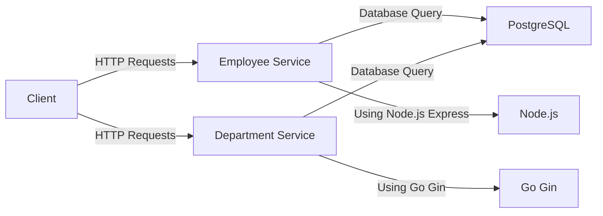

```mermaid
graph LR
    A[Client] -->|HTTP Requests| B[Employee Service]
    A -->|HTTP Requests| C[Department Service]
    B -->|Database Query| D[PostgreSQL]
    C -->|Database Query| D
    B -->|Using Node.js Express| E[Node.js]
    C -->|Using Go Gin| F[Go Gin]
```