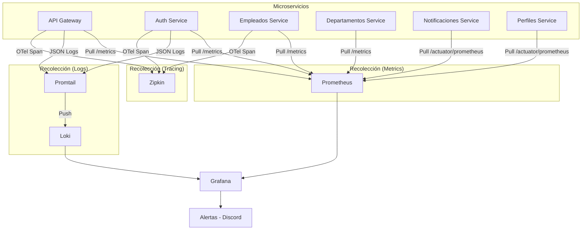
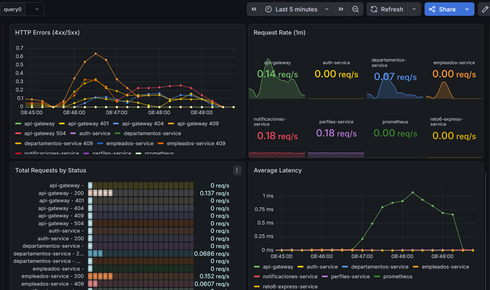
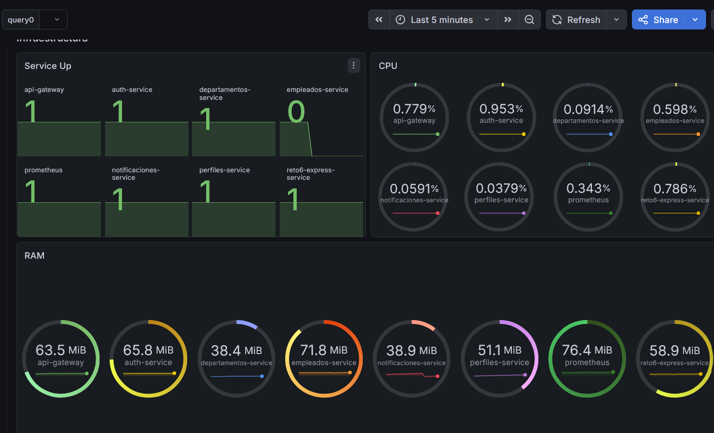
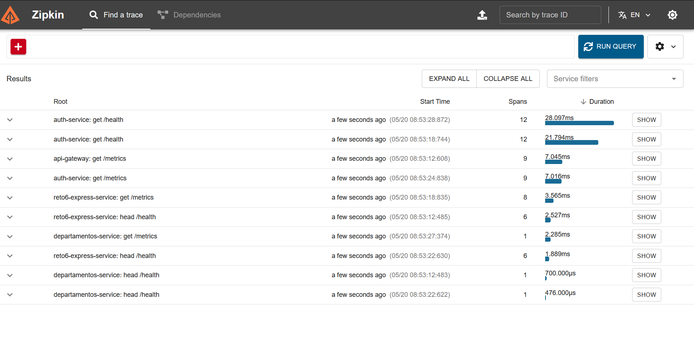
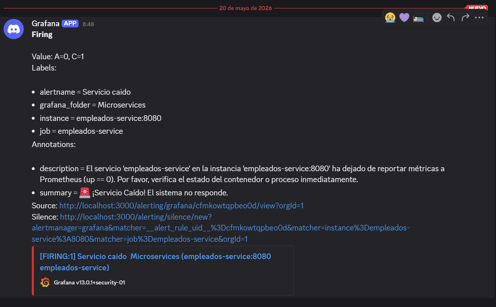

# 📊 Reto 7: Observabilidad en Microservicios

Este repositorio contiene la implementación completa de un stack de observabilidad para un ecosistema de microservicios heterogéneo.

---

## 1. Arquitectura de Observabilidad

El sistema utiliza un enfoque de **observabilidad en tres pilares** (Métricas, Logs y Trazas) diseñado para sistemas distribuidos.

### Diagrama de Arquitectura

### Diagrama de Flujo (Lógica Interna)

---

## 2. Investigación de Conceptos Clave

### A. Pull vs. Push (Métricas)
*   **Modelo Pull (Prometheus):** El servidor de métricas solicita los datos a los servicios. Es más fácil de escalar horizontalmente y no sobrecarga a los servicios si el recolector falla.
*   **Modelo Push (InfluxDB/StatsD):** Los servicios envían proactivamente sus métricas. Útil para tareas efímeras (Serverless/Jobs) donde el servicio no vive lo suficiente para ser "scraped".

### B. OpenTelemetry (OTel)
Es un framework de observabilidad estándar de la industria (CNCF) que proporciona un conjunto único de APIs y bibliotecas para generar y recolectar trazas, métricas y logs sin depender de un proveedor específico (vendor-agnostic).

### C. W3C Trace Context
Es un estándar que define campos HTTP universales (`traceparent`, `tracestate`) para propagar información de contexto de trazas entre servicios de diferentes lenguajes y proveedores, asegurando que el `trace-id` se mantenga idéntico en toda la cadena de llamadas.

---

## 3. Instrumentación por Servicio

| Servicio | Lenguaje | Librería Métricas | Librería Trazabilidad |
|----------|----------|-------------------|-----------------------|
| **API Gateway** | Node.js | `prom-client` | `@opentelemetry/sdk-node` |
| **Auth Service** | Node.js | `prom-client` | `@opentelemetry/sdk-node` |
| **Empleados** | Node.js | `prom-client` | `@opentelemetry/sdk-node` |
| **Departamentos**| Go | `client_golang` | `otelgo` |
| **Notificaciones**| Java (Spring)| `Micrometer` | `otel-spring-boot-starter` |
| **Perfiles** | Java (Spring)| `Micrometer` | `otel-spring-boot-starter` |

---

## 4. Justificación: Zipkin vs. Jaeger

Hemos elegido **Zipkin** para este proyecto por las siguientes razones:
1.  **Simplicidad:** Su configuración inicial es extremadamente sencilla con una sola imagen Docker.
2.  **Compatibilidad:** Posee soporte nativo para los propagadores B3 y TraceContext, facilitando la integración con Spring Boot y Node.js.
3.  **Recursos:** Consume menos memoria RAM que una instancia completa de Jaeger, lo cual es ideal para un entorno de desarrollo local con muchos microservicios.

---

## 5. Configuración de Alertas

*   **Canal:** Webhook de Discord.
*   **Configuración:**
    1.  Se creó un servidor de Discord y un canal de `#alertas-sistema`.
    2.  En Grafana, se añadió un **Contact Point** de tipo Discord pegando la URL del Webhook.
    3.  Se definieron reglas de alerta en Grafana (Alert Rules) para detectar servicios caídos (`up == 0`).

---

## 6. Pruebas de Caos y Hallazgos

### Capturas de Pantalla
> *Las imágenes se encuentran en la carpeta `/observability/assets/`*

1.  **Dashboard de Grafana - Salud:**
    

2.  **Dashboard de Grafana - Infraestructura:**
    

3.  **Trazas en Zipkin (Cascada completa):**
    
4.  **Alerta recibida en Discord:**
    

### Pregunta de Análisis
**¿Qué servicio del ecosistema tardó más en responder y cómo lo identificaron?**

**Respuesta:** El servicio que presentó mayor latencia fue el **`perfiles-service`** (Java/Spring Boot) durante las peticiones iniciales.
**Evidencia:** Se identificó mediante el panel de **Average Latency** en Grafana, donde los picos iniciales superaban los 500ms, y se confirmó en **Zipkin**, observando que el span correspondiente al `perfiles-service` consumía el 70% del tiempo total de la transacción debido al tiempo de conexión inicial con la base de datos (Cold Start de JPA/Hibernate).

---

## 7. Cómo ejecutar
1.  `docker compose up --build -d`
2.  Ejecutar `./simulate_traffic.sh` para ver datos en vivo.
3.  Acceder a Grafana en `http://localhost:3001` (admin/admin).
